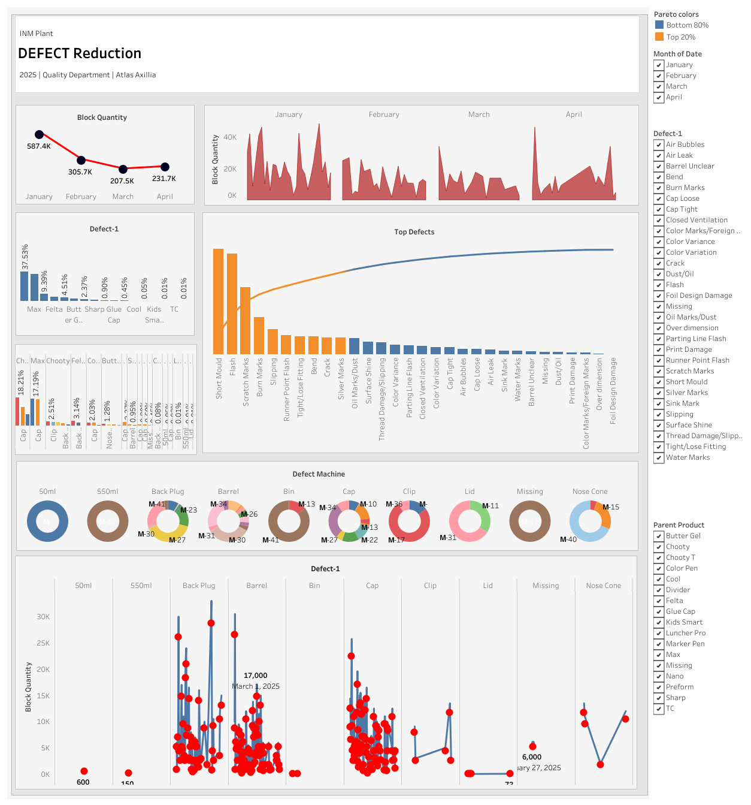

# 📉 Defect Reduction Analysis Dashboard

This Tableau dashboard provides an in-depth analysis of product defects to support quality improvement initiatives. Built as part of my internship at **Atlas**, it aims to identify root causes, monitor defect machines, and reduce waste in the production process.

🔗 **[View the Live Dashboard on Tableau Public](https://public.tableau.com/views/DefectReductionAnalysis/Dashboard2?:language=en-US&:sid=&:redirect=auth&:display_count=n&:origin=viz_share_link)**
## 📊 Dashboard Preview

### 🖼️ Image View

### 📄 PDF Version
[Click here to view the full Dashboard (PDF)](Dashboard.pdf)

---

## 🔍 Key Features

- 📊 Visual summary of total defects over time
- 🏭 Breakdown by monthy the lot of block quantity
- ⚠️ Highlights of highest-impact defects (Top Defects)
- ⚠️ Highlights the parents products and items of relevent defects
- ⚠️ Highlights the defect machines in any components produced   
- 📈 Trend analysis for early detection and correction
- 🔍 Filters for focused investigation

---

## 🛠️ Tools & Technologies

- Tableau Public  
- Excel (as data source)  
- Quality Assurance principles  
- Data Cleaning & Preprocessing  

---

## 📌 Use Case

This dashboard is designed to be used by QA teams and plant managers to:

- Monitor real-time defect rates
- Identify highst impact defects
- Find about most defects come from which parent products and items
- Find the machines for services and repair
- Discover the items 
- Discover patterns in production issues  
- Take data-driven corrective actions
- Asses the improvement and growth in Quality Department 

---

## 👨‍💻 Author

**Asanka Dissanayaka**  
🎓 QA Analyst Intern at Atlas  
📊 [GitHub Profile](https://github.com/Asanka-Data-Analyst)  
🔗 [LinkedIn](https://www.linkedin.com/in/asanka-dissanayaka-b341712a9)

---

## 📂 Repository Contents

- `README.md` – Project overview  
- `images/` – Dashboard preview
- `pdf/` – Dashboard preview  
  

---

## ⭐ Future Enhancements

- Add navigation to severel dashboards for deep analytics
- Add embedded iframe version  
- Link dashboard to live production data  
  
  
